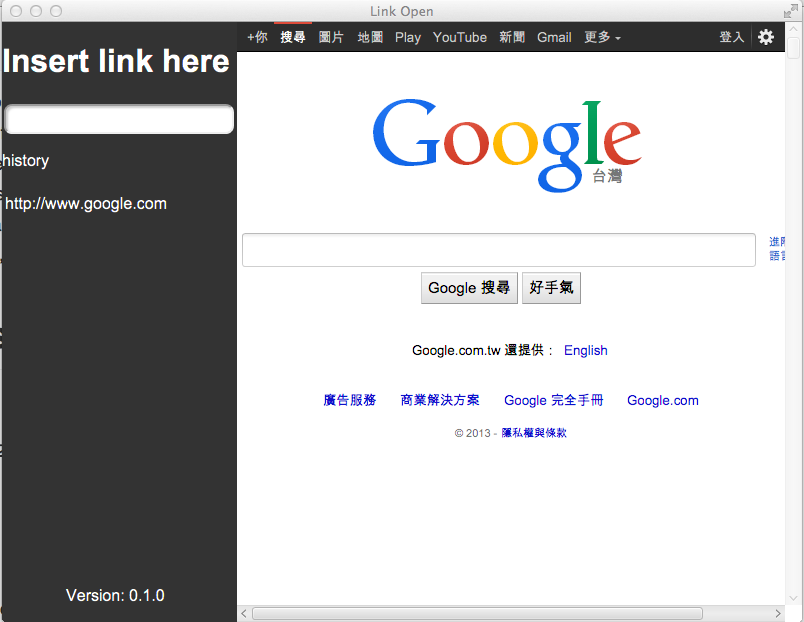

# Link Open 

This is a simple javafx application written in Clojure/Clojurescript,
which will open file or make javafx browser switch to http link
accodring to user input.

## Usage

To compile this application, you need to use following command

    lein deps
    lein scss once
    lein cljsbuild once
    lein uberjar
    lein run

## Screenshots

## License

Copyright © 2014 coldnew

Distributed under the Eclipse Public License either version 1.0 or (at
your option) any later version.
